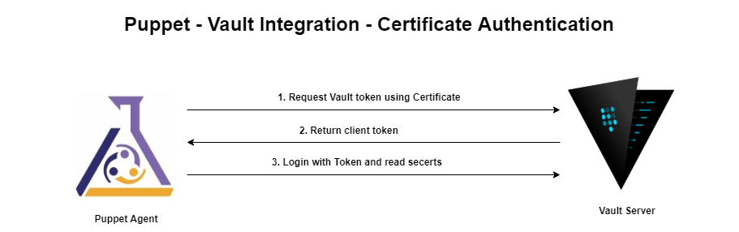
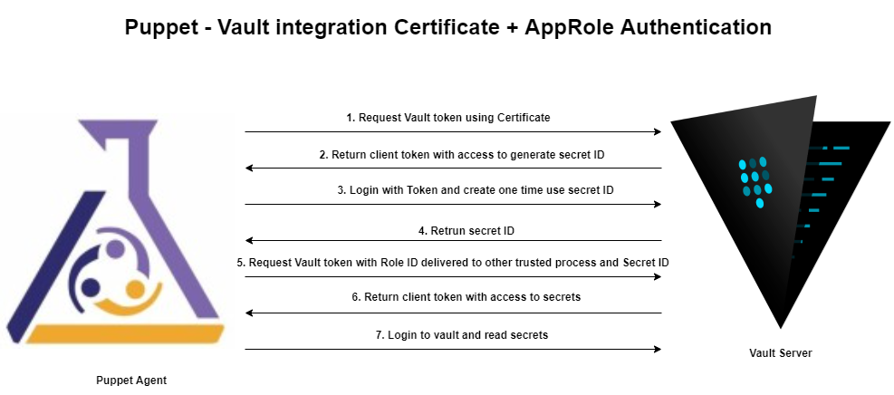
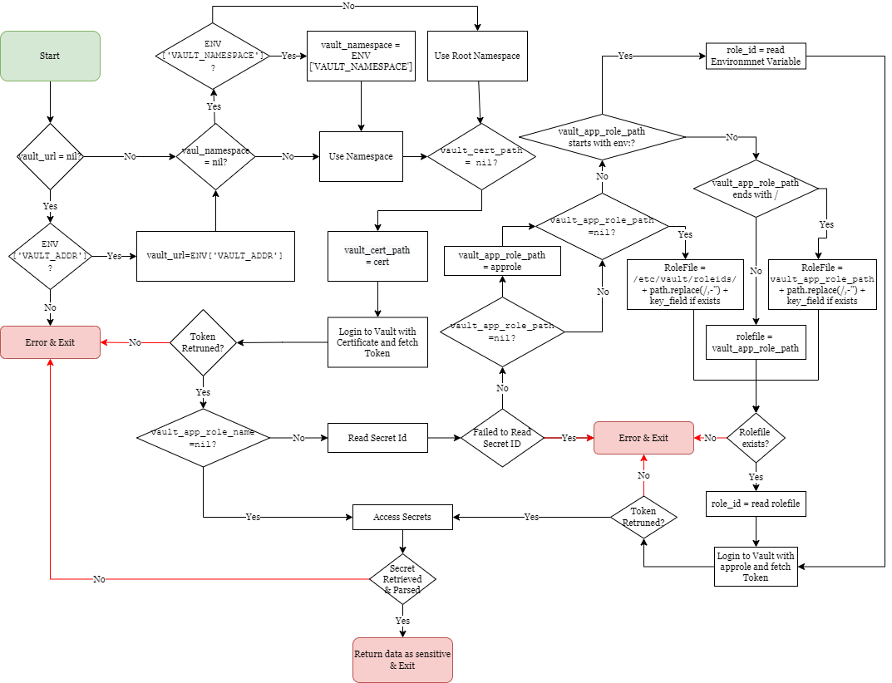

# vault_lookup

Module to integrate Puppet 6 and Puppet Enterprise 2019 agents with Hashicorp
Vault.

#### Table of Contents

1. [Description](#description)
2. [Requirements](#requirements)
2. [Process Flow](#flow)
3. [Setup - The basics of getting started with vault_lookup](#setup)
5. [Function Parameters](#parameters)
4. [Usage - Configuration options and additional functionality](#usage)

## Description

For users with a Puppet Enterprise 2019 or open source Puppet 6 infrastructure wanting to leverage secrets from an existing [Hashicorp Vault](https://www.vaultproject.io/) server. Used with Puppet 6's Deferred type, this allows agents to retrieve secrets from Vault when a catalog is applied. In this way, the secret data is not embedded in the catalog and the master never sees it. See [this blog post](https://puppet.com/blog/secret-agents-man-secrets-store-integrations-puppet-6) for more information and other secret store integrations.

Authentication with Vault is achieved via Puppet certificates. See the Vault documentation for more information on setting up finer grained access controls.

## Requirements

This is expected to be run using the `Deferred` type, which requires Puppet 6.0.0 or later, and of course [Vault](https://www.vaultproject.io/) to store the data.

## Flow

### Using Certificate Authentication (Option#1)

In this method, Puppet agent will use Server Certificate to authenticate with Vault using Certificate Authentication method. Vault server will return token with access to secrets.


Disadvantage with this method is, any one who gets access to server certificates will have access to secrets in vault.

### Using Combination of Certificate and AppRole Authentication (Option#2)

In this method, Puppet agent will use Server Certificate to authenticate with Vault using Certificate Authentication method. Vault server will return token with access to generate single-use secret id. Please note that this token does not have access to any secrets in vault. Using completely different method Role ID would need to delivered to server in file or Environment variable. Puppet agent would use the RoleID  on the server and Secret ID generated during puppet Run to login to Vault. Vault server issues token with access to secrets.



With this approach, authentication to get access to secrets is a two stage process. Just having a Server Certificate or role id would not give access to secrets. it is combination of both authentication methods that would allow access to secrets. It is not fool proof method but makes it more secure than just using Option#1.

### Puppet Module - Function FlowDiagram



## Setup

The `vault_lookup` function uses the Puppet agent's certificates in order to authenticate to the Vault server; this means that before any agents contact a Vault server, you must configure the Vault server with the Puppet Server's CA certificate, and Vault must be part of the same certificate infrastructure.

If the puppet Server's CA is not part of the certificate infrastructure that Vault uses, add Root and intermediate certificates to Puppet Server's CA.

```shell
    cat /etc/puppetlabs/puppet/ssl/certs/ca.pem \
    /opt/vault/rootcerts/rootca.cer \
    /opt/vault/rootcerts/intermediateca.cer  > /opt/vault/rootcerts/puppetca.pem
```

To set up Vault to use the Puppet Server CA cert:

1. Set up Vault using Puppet certs (if not already set up this way)

If the Vault host has a Puppet agent on it then you can just use the existing certificates. Otherwise generate a new certificate with `puppetserver ca` and copy the files.

```shell
puppetserver ca generate --certname my-vault.my-domain.me
```

In the Vault listener configuration, set `tls_client_ca_file` as the Puppet CA cert, `tls_cert_file` as the agent or generated certificate, and `tls_key_file` as the agent or generated private key.

2. Enable cert auth for Vault

Hashicorp’s Vault supports a variety of auth methods that are listed in their documentation; the auth method required for usage with the vault_lookup function is named cert, and can be turned on with the Vault CLI:

```shell
vault auth enable cert
```

this would enable cert auth method with default path `cert`. if you like to enable cert auth method with specific path pass `-path=` parameter.

```shell
vault auth enable -path=auth-cert cert
```

3. Enable approle auth for Vault.

If you are planning to use combination of Cert authentication method and Approle Authentication method provided in Option#2, you will need to enable `App Role` authentication method. _Please skip this if you are just using Cert authentication method.

```shell
vault auth enable -description "approle" -path=auth-approle approle
```

default path if you do not specify `-path=` parameter is approle.

4. Create a policy to allow access to secrets.

Following policy would allow read access to secrets stored in `secrets/data/puppet-vault-test` path. this policy is enough if you choose to go with Option#1.

```shell
  vault policy write puppet-acl-test - <<EOF
  # Policy name: puppet-acl-test
  #
  # Read-only permission on 'secrets/data/puppet-vault-test' path
  path "secrets/data/puppet-vault-test" {
    capabilities = [ "read" ]
  }
  EOF
```

If you are planning to use Option#2, you will need to create policy that would allow puppet agent to create secret ID.

```shell
  vault policy write puppet-secretid-policy - <<EOF
  # Allow access to generate secret ID
  path "auth/auth-approle/role/puppet/secret-id" {
    capabilities = ["create", "update"]
  }
  EOF
```

5. Create a sample secret that you want to read using puppet

```shell
  vault kv put secrets/data/puppet-vault-test testsecret=secret secondsupersecret=supersecret
```

6. Upload the Puppet Server CA certificate to Vault.

After cert auth has been enabled for Vault, upload the CA certificate from your Puppet Server to Vault and add it as a trusted certificate.

if you are planning to use Option#1, you would need to configure policy `puppet-acl-test` which allows access to secrets. please note my auth role name here is `puppetserver`

```shell
  vault write auth/auth-cert/certs/puppetserver \
    display_name=puppet \
    policies=puppet-acl-test \
    certificate=@/opt/vault/rootcerts/puppetca.pem \
    ttl=3600
```

These roles can be restricted to certain server names or even use oid's to authenticate, which are set with the /etc/puppetlabs/puppet/csr_attributes.yaml file during provisioning

Following role will only allow access to secrets for server certificate with common name "node1.domain.local"

```shell
  vault write auth/auth-cert/certs/puppetserver \
    display_name=puppet \
    policies=puppet-acl-test \
    certificate=@/opt/vault/rootcerts/puppetca.pem \
    allowed_common_names="node1.domain.local" \
    ttl=3600
```

Following role will allow access to secrets for server certificate with common name matching "domain.local"

```shell
  vault write auth/auth-cert/certs/puppetserver \
    display_name=puppet \
    policies=puppet-acl-test \
    certificate=@/opt/vault/rootcerts/puppetca.pem \
    allowed_common_names="*.domain.local" \
    ttl=3600
```

Following role will allow access to secrets for server certificate with extensions matching to "1.3.6.1.4.1.34380.1.1.22:vaultok". For more about extensions please check [here](https://puppet.com/docs/puppet/5.5/ssl_attributes_extensions.html)

```shell
  vault write auth/auth-cert/certs/puppetserver \
    display_name=puppet \
    policies=puppet-acl-test \
    certificate=@/opt/vault/rootcerts/puppetca.pem \
    required_extensions="1.3.6.1.4.1.34380.1.1.22:vaultok" \
    ttl=3600
```

Once the certificate has been uploaded, any Puppet agent with a signed certificate will be able to authenticate with Vault.

If you are planning to use Option#2, you will need to create role under Approle authentication method along with Certificate Role. Please note our Certificate role now has `puppet-secretid-policy` policy that would only allow access to create single use secret ID. Approle policy will have access to read secrets.

```shell
  vault write auth/auth-cert/certs/puppetserver \
    display_name=puppet \
    policies=puppet-secretid-policy \
    certificate=@/opt/vault/rootcerts/puppetca.pem \
    ttl=3600
```

```shell
vault write auth/auth-approle/role/puppet \
    secret_id_ttl=10m \
    token_num_uses=10 \
    token_ttl=20m \
    token_max_ttl=30m \
    secret_id_num_uses=1 \
    token_policies="puppet-acl-test"
```
## Parameters

|Parameter|Optional/Mandatory|Default Vaule|description         |
|:-----------:|:-------------:|:---------------:|:-----------------------------------------:|
|**path**|Mandatory||path of secret to read.|
|**vault_url**|Optional|Nil|if not provided, i will look for VAULT_ADDR environment variable. if the environment variable is not set, it would fail.|
|**vault_namespace**|Optional|Nil|if not provided, it will look for VAULT_NAMESPACE environment variable. if the environment variable is not set, it would connect try to connect to root namespace.|
|**vault_cert_path**|Optional|cert|if not provided, assumes cert auth method is enabled on default path 'cert'.|
|**vault_cert_role**|Optional|puppetserver|if not provided, assumes role as 'puppetserver'.|
|**key_field**|Optional|Nil|If not provided Hash of both key and value pair stored in the secret path would return.|
|**vault_app_role_path**|Optional|Nil|Path for Approle Authentication method. If not provided Puppet agent will use Certificate authentication to access secrets.|
|**vault_app_role_name**|Optional|Nil|Role name under Approle Authentication method. If not provided Puppet agent will use Certificate authentication to access secrets.|
|**vault_role_id_path**|Optional|Nil|File Name or Folder location or Environment Variable, where Role ID is stored. if this value starts with `env:` puppet would try to read Environment variable. if only folder location is provided, Puppet will construct filename with path and key field. If not provided Puppet agent will use Certificate authentication to access secrets.|

## Usage

Install this module as you would in any other; the necessary code will be distributed to Puppet agents via pluginsync.

In your manifests, call the `vault_lookup::lookup` function using the Deferred type. For example:

* Example 1: The lookup function will be run on the agent and the value of `$d` will be resolved when the catalog is applied. This will make a call to `https://vault.hostname:8200/v1/secrets/puppet-vault-test` and wrap the result in Puppet's `Sensitive` type, which prevents the value from being logged. Please note that this would return hash of all secrets stored under the path `secrets/puppet-vault-test`. The following function call assume Cert authentication method is enabled under path `cert` and secrets are stored in Root namespace.

```puppet
$d = Deferred('vault_lookup::lookup', ["secrets/puppet-vault-test", 'https://vault.hostname:8200'])

node default {
  notify { example :
    message => $d
  }
}
```

* Example 2: You can also choose not to specify the Vault URL, and then Puppet will use the `VAULT_ADDR` environment variable. This will be either set on the command line, or set in the service config file for Puppet, on Debian `/etc/default/puppet`, on RedHat `/etc/sysconfig/puppet`:

```puppet
$d = Deferred('vault_lookup::lookup', ["secrets/puppet-vault-test"])

node default {
  notify { example :
    message => $d
  }
}
```

**Note: if you are using KVv1 path should look like _secrets/puppet-vault-test_. If you are using KVv2, path should include `data` like _secrets/`data`/puppet-vault-test_**

* Example 3: you can choose to access custom certificate auth method. following example is accessing cert auth method enabled with path `auth-cert` instead of default path `cert`.

```puppet
  $d = Deferred('vault_lookup::lookup', ['secrets/data/puppet-vault-test', 'https://vault.hostname:8200',,'auth-cert','puppetserver'])
  node default {
    notify { example :
      message => $d
    }
  }
```

* Example 4: If you are using Vault Enterprise edition and want to access secrets under vault namespace, you can pass Vault namespace name as parameter  or set Environment variable `VAULT_NAMESPACE`.

```puppet
  $d = Deferred('vault_lookup::lookup', ['secrets/data/puppet-vault-test', 'https://vault.hostname:8200','namespace1`,'auth-cert','puppetserver'])
  node default {
    notify { example :
      message => $d
    }
  }
```

* Example 5: If you want access specific secrets stored under path instead of pulling hash of all secrets stored under path, you can pass key name as parameter.

```puppet
  $d = Deferred('vault_lookup::lookup', ['secrets/data/puppet-vault-test', 'https://vault.hostname:8200','namespace1`,'auth-cert','puppetserver','testsecret'])
  node default {
    notify { example :
      message => $d
    }
  }
```

* Example 5: If you want use combination of Cert and Approle authentication methods (Option#2) you can pass approle path, role name and role ID location as parameters.

```puppet
  $d = Deferred('vault_lookup::lookup', ['secrets/data/puppet-vault-test', 'https://vault.hostname:8200','namespace1`,'auth-cert','puppetserver','testsecret','auth-approle','puppet','/etc/vault/rolefiles/roleid1'])
  node default {
    notify { example :
      message => $d
    }
  }
```

* Example 6: if you path folder path as role ID location, puppet will construct role ID file as path + Key field if exists. For example following function call would look for role id file `/etc/vault/rolefiles/secrets-data-puppet-vault-test-testsecret`

```puppet
  $d = Deferred('vault_lookup::lookup', ['secrets/data/puppet-vault-test', 'https://vault.hostname:8200','namespace1`,'auth-cert','puppetserver','testsecret','auth-approle','puppet','/etc/vault/rolefiles/'])
  node default {
    notify { example :
      message => $d
    }
  }
```

* Example 7: if you do not pass role ID location, puppet would look for role ID file as path + Key field if exists under folder `/etc/vault/roleids/`. For example following function call would look for role id file `/etc/vault/roleids/secrets-data-puppet-vault-test-testsecret`

```puppet
  $d = Deferred('vault_lookup::lookup', ['secrets/data/puppet-vault-test', 'https://vault.hostname:8200','namespace1`,'auth-cert','puppetserver','testsecret','auth-approle','puppet',])
  node default {
    notify { example :
      message => $d
    }
  }
```

* Example 8: you can also set role ID as environment variable. for example following function call would look for role ID stored in environment variable `PUPPET_ROLEID`

```puppet
  $d = Deferred('vault_lookup::lookup', ['secrets/data/puppet-vault-test', 'https://vault.hostname:8200','namespace1`,'auth-cert','puppetserver','testsecret','auth-approle','puppet','env:PUPPET_ROLEID'])
  node default {
    notify { example :
      message => $d
    }
  }
